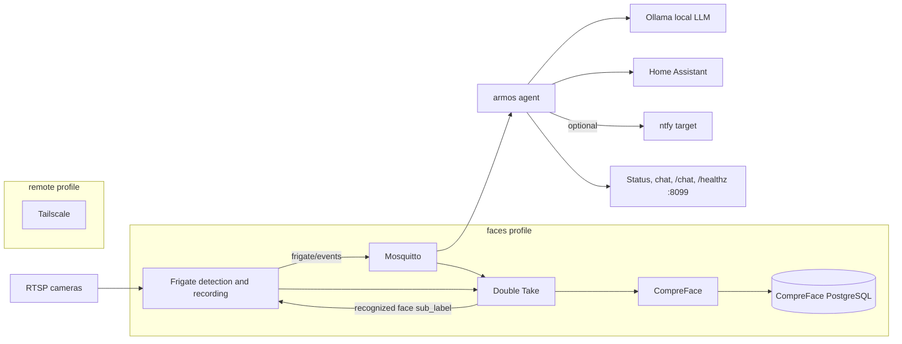

# Architecture

OpenArmos keeps detection, inference, automation, and persistent data on the local Docker host. Mosquitto is the event bus. The `armos` service is the decision layer.

## Event flow

1. A camera sends an RTSP stream to Frigate.
2. Frigate detects and tracks configured objects, records local media, evaluates zones, and publishes JSON to `frigate/events`.
3. When the `faces` profile is active, Double Take receives the person event and requests Frigate snapshots.
4. Double Take sends face crops to CompreFace. On a match, it updates the Frigate event's `sub_label`.
5. Frigate republishes the updated event. The recognized name is available at `after.sub_label`.
6. `armos` consumes the event, combines it with `MODE`, `ARMED_ZONES`, and `KNOWN_FACES`, and asks the local Ollama model to score and explain the event.
7. `armos` logs or pushes a natural-language notification. When policy calls for lockdown, it uses the Home Assistant API to act on `HA_LOCKS` and `HA_GATE`.
8. The same agent exposes status, chat, `/chat`, and `/healthz` on port 8099.

## Profiles

| Profile | Services | Purpose |
| --- | --- | --- |
| default core | Mosquitto, Ollama, Home Assistant, Frigate, armos | Detection, MQTT, local inference, automation, status, and chat |
| `faces` | Double Take plus five CompreFace containers | Optional face training, matching, and Frigate `sub_label` updates |
| `remote` | Tailscale | Optional encrypted mesh access to host-published services |

The `faces` profile is materially heavier. It adds PostgreSQL, two Java services, the CompreFace embedding service, its frontend, and Double Take.

## Storage

Docker named volumes keep service state outside container lifecycles:

- `ollama-data`: local model weights
- `homeassistant-config`: Home Assistant configuration and database
- `frigate-config`: Frigate-generated config state and model cache
- `frigate-media`: recordings, clips, and snapshots
- `double-take-data`: face crops, matches, training data, and runtime state
- `compreface-postgres-data`: users, API service metadata, embeddings, and optional images
- `mosquitto-data` and `mosquitto-logs`: MQTT persistence and logs
- `tailscale-state`: remote profile identity and node state

Removing containers does not remove these volumes. `docker compose down -v` does.

## Network and data boundary

All application containers share the private `openarmos` bridge network. Camera streams terminate at Frigate. MQTT events, face crops, embeddings, prompts, model responses, Home Assistant calls, and stored footage remain on the local network during default core operation.

Nothing in the default runtime sends footage or inference data outside the network. Pulling container images and Ollama models requires internet access during setup.

There are two explicit exceptions:

- A non-empty `NTFY_URL` sends the generated notification payload to that target. Do not use a hosted target if the text must remain local.
- The `remote` profile connects a Tailscale node to its coordination service and carries explicitly requested remote traffic over an encrypted mesh. It is disabled by default.

Mosquitto allows anonymous clients for a low-friction local setup. Keep port 1883 on a trusted LAN. Before deployment on an untrusted network, add credentials, ACLs, and TLS or remove its host port.
